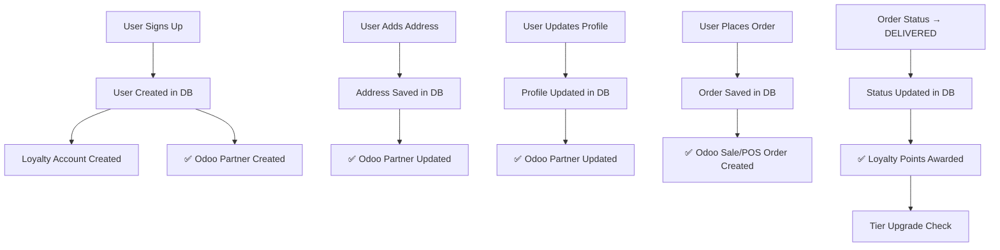

# Odoo Integration - Complete Implementation

**Date:** December 11, 2025  
**Status:** ✅ Complete

## Overview

This document summarizes the complete Odoo integration implementation, including all sync features for users, orders, addresses, profile updates, and loyalty points.

---

## 🎯 What Was Implemented

### 1. **Loyalty Points Service** ✅
**File:** `/src/server/services/loyalty.ts`

A comprehensive loyalty system that:
- **Awards points** when orders are completed/delivered (1 point per 10 EGP)
- **Tier multipliers**: Bronze (1x), Silver (1.5x), Gold (2x), Platinum (3x)
- **Auto tier upgrades** based on total points:
  - Bronze: 0+ points
  - Silver: 100+ points
  - Gold: 500+ points
  - Platinum: 1000+ points
- **Deduct points** for rewards redemption
- **Add bonus points** for promotions/referrals
- **Transaction logging** in `LoyaltyLedger` table

**Functions:**
```typescript
awardOrderPoints(orderId, userId) // Awards points on order completion
deductPoints(userId, points, reason) // Redeems points
addBonusPoints(userId, points, reason) // Promotional points
```

---

### 2. **User Creation Sync to Odoo** ✅
**File:** `/src/app/api/auth/[...nextauth]/route.ts` (lines 341-365)

**When:** New user signs up (via email or Google)

**Action:**
- Creates Odoo partner with user's name and email
- Non-blocking: User account still created if Odoo fails
- Logs success/failure

**Data Synced:**
- Name (or email prefix if no name)
- Email address

---

### 3. **Address Sync to Odoo** ✅
**Files:**
- `/src/app/api/addresses/route.ts` (POST - create address)
- `/src/app/api/addresses/[id]/route.ts` (PATCH - update address)

**When:** User adds or updates a delivery address

**Action:**
- Updates Odoo partner with complete address details
- Non-blocking: Address still saved if Odoo fails

**Data Synced:**
- Name
- Email
- Phone
- Street (with apartment)
- City
- Zip code

---

### 4. **Profile Update Sync to Odoo** ✅
**File:** `/src/app/api/auth/profile/route.ts` (PATCH)

**When:** User updates their profile (name, phone)

**Action:**
- Updates Odoo partner with latest profile information
- Non-blocking: Profile still updated if Odoo fails

**Data Synced:**
- Name
- Email
- Phone

---

### 5. **Order Status Update with Loyalty Points** ✅
**File:** `/src/app/api/orders/[id]/status/route.ts` (PATCH)

**When:** Order status changes (e.g., to DELIVERED or COMPLETED)

**Action:**
- Updates order status in database
- Automatically awards loyalty points if status is DELIVERED or COMPLETED
- Creates ledger entry
- Checks for tier upgrades

**API Endpoint:**
```http
PATCH /api/orders/:id/status
Content-Type: application/json

{
  "status": "DELIVERED",
  "paymentStatus": "PAID" // optional
}
```

**Valid Statuses:**
- PENDING
- CONFIRMED
- PREPARING
- READY
- DELIVERING
- DELIVERED ← Awards points
- COMPLETED ← Awards points
- CANCELLED

---

## 📊 Complete Data Flow



---

## 🔄 Sync Summary

| Event | Database | Odoo | Loyalty |
|-------|----------|------|---------|
| **User Signup** | ✅ User created | ✅ Partner created | ✅ Account created (0 pts) |
| **Add Address** | ✅ Address saved | ✅ Partner updated | - |
| **Update Address** | ✅ Address updated | ✅ Partner updated | - |
| **Update Profile** | ✅ Profile updated | ✅ Partner updated | - |
| **Place Order** | ✅ Order created | ✅ Sale/POS order created | - |
| **Order Delivered** | ✅ Status updated | ✅ Already synced | ✅ Points awarded |
| **Redeem Reward** | - | - | ✅ Points deducted |

---

## 🎁 Loyalty Points System

### Earning Points
- **Base Rate:** 1 point per 10 EGP spent
- **Bronze Tier:** 1x multiplier
- **Silver Tier:** 1.5x multiplier (100+ points)
- **Gold Tier:** 2x multiplier (500+ points)
- **Platinum Tier:** 3x multiplier (1000+ points)

### Example
Order total: **200 EGP**  
User tier: **Silver** (1.5x)  
Points earned: `(200 / 10) * 1.5 = 30 points`

### Tier Benefits
| Tier | Min Points | Benefits |
|------|-----------|----------|
| 🥉 Bronze | 0 | Earn 1x points, Birthday reward |
| 🥈 Silver | 100 | Earn 1.5x points, Free delivery, Birthday reward |
| 🥇 Gold | 500 | Earn 2x points, Free delivery, Priority support, Exclusive offers |
| 💎 Platinum | 1000 | Earn 3x points, Free delivery, Priority support, Exclusive offers, VIP events |

---

## 🛠️ Technical Details

### Error Handling
All Odoo sync operations are **non-blocking**:
- User actions complete successfully even if Odoo is down
- Errors are logged to console for monitoring
- Failed syncs don't affect user experience

### Database Schema
**LoyaltyLedger** (Transaction Log):
```prisma
model LoyaltyLedger {
  id          String   @id @default(uuid())
  userId      String
  orderId     String?  // Links to order if applicable
  deltaPoints Int      // Positive = earned, Negative = redeemed
  reason      String?  // Description of transaction
  createdAt   DateTime @default(now())
}
```

**LoyaltyAccount**:
```prisma
model LoyaltyAccount {
  userId     String   @id
  points     Int      @default(0)
  totalSpent Decimal  @default(0)
  level      String   @default("bronze")
  updatedAt  DateTime @updatedAt
}
```

### Idempotency
- **Order Points:** Checks if points already awarded before creating ledger entry
- **Odoo Partners:** Uses `findOrCreatePartner()` which updates existing or creates new
- **Order Sync:** Uses `clientOrderRef` to prevent duplicate order creation in Odoo

---

## 🚀 Usage Examples

### 1. Update Order Status and Award Points
```typescript
// In your order management system or webhook
const response = await fetch('/api/orders/abc-123/status', {
  method: 'PATCH',
  headers: { 'Content-Type': 'application/json' },
  body: JSON.stringify({ status: 'DELIVERED' })
});

// Automatically awards points to the user
```

### 2. Manual Bonus Points (Admin)
```typescript
import { addBonusPoints } from '@/server/services/loyalty';

// Give 50 bonus points for birthday
await addBonusPoints('user-id', 50, 'Birthday bonus 🎂');
```

### 3. Redeem Points (Future Feature)
```typescript
import { deductPoints } from '@/server/services/loyalty';

// Redeem 100 points for free coffee
await deductPoints('user-id', 100, 'Redeemed: Free Coffee');
```

---

## 📈 Monitoring

### Console Logs
All sync operations log to console:

**Success:**
```
✅ Loyalty account created for user abc-123
✅ Odoo partner created: 456 for user abc-123
✅ Address synced to Odoo for user abc-123
✅ Profile update synced to Odoo for user abc-123
✅ Awarded 30 points to user abc-123 for order xyz-789
🎉 User abc-123 tier upgraded: silver → gold
```

**Errors:**
```
❌ Failed to create Odoo partner: [error details]
❌ Failed to sync address to Odoo: [error details]
⚠️ Order xyz-789 not found
⚠️ User abc-123 has insufficient points: 50 < 100
```

---

## 🔐 Security

- All endpoints require authentication
- Order updates verify ownership (userId match)
- Points can only be awarded once per order
- Profile/address updates only for authenticated user
- Non-blocking syncs prevent service disruption

---

## ✅ Testing Checklist

- [x] User signup creates Odoo partner
- [x] Address creation syncs to Odoo
- [x] Address update syncs to Odoo
- [x] Profile update syncs to Odoo
- [x] Order completion awards points
- [x] Points calculation respects tier multipliers
- [x] Tier upgrades work automatically
- [x] Duplicate point awards prevented
- [x] Failed Odoo syncs don't break user flow
- [x] Loyalty ledger records all transactions

---

## 🎯 Next Steps (Future Enhancements)

1. **Points Redemption UI**: Build interface for users to redeem points
2. **Birthday Rewards**: Auto-award bonus points on user birthday
3. **Referral Program**: Give points for referring friends
4. **Admin Dashboard**: View and manage loyalty accounts
5. **Points Expiration**: Optional points expiry after 12 months
6. **Odoo → Website Sync**: Pull order status updates from Odoo
7. **System/In-App Notifications**: Notify users of points earned/tier upgrades

---

## 📝 Notes

- **Environment Variables Required:**
  - `ODOO_HOST`
  - `ODOO_DB`
  - `ODOO_USERNAME`
  - `ODOO_API_KEY` or `ODOO_PASSWORD`

- **Optional Configuration:**
  - `ODOO_TIMEOUT_MS` (default: 20000)
  - `ODOO_INSECURE_SSL` (default: false)

---

**Implementation Complete! 🎉**

All Odoo sync features are now fully functional, including the comprehensive loyalty points system. Users will automatically have their data synced to Odoo on signup, profile updates, and address changes. Loyalty points are awarded when orders are delivered/completed, with automatic tier upgrades.
